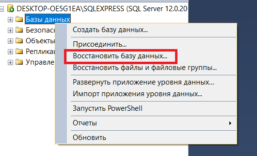
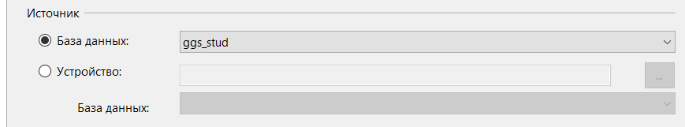
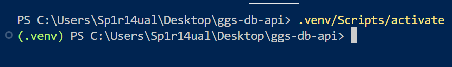
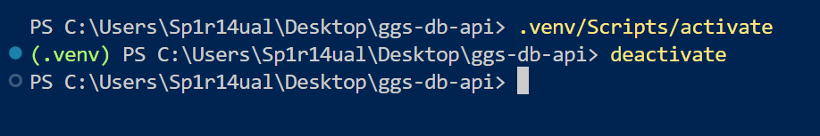
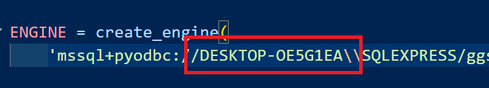
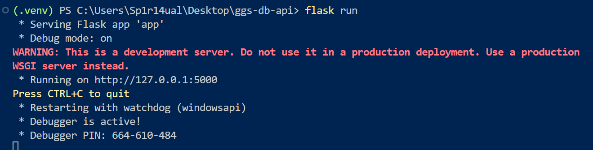
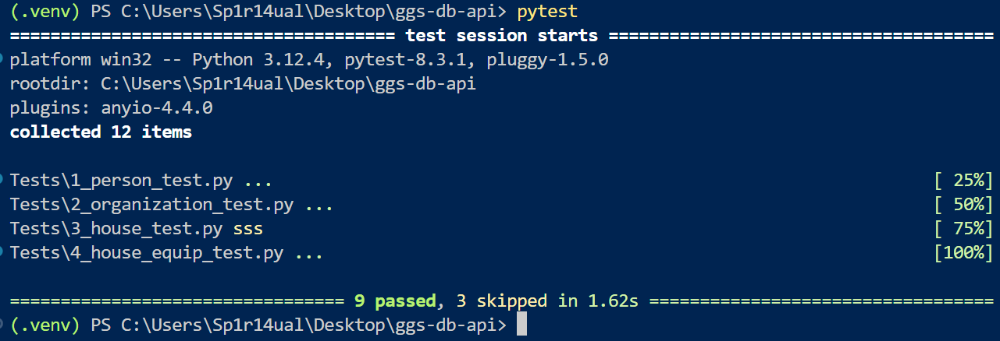

# GGS Stud API

Данный проект представляет собой API для взаимодействия с базой данных ggs-stud.

Инструкция по установки:

1. Убедитесь в том, что на устройстве корректно развёрнута база данных ggs_stud.
   Для этого в SQL Server Management Studio проделайте следующие действия:
   `"Базы данных" -> "Восстановить базу данных..."`

   

   После чего в поле "Источник" выберите "База данных", укажите путь до бэкапа БД и нажмите "ОК", после чего запустится развёртывание БД

   

2. В директории с проектом требуется развернуть виртуальное окружение Python.
   Для этого в командной строке выполните следующий сценарий

```shell
python -m venv .venv
.venv/Scripts/activate
```

Либо

```shell
python -m pip install virtualenv
python -m virtualenv .venv
.venv/bin/activate
```

В командной строке появится индикатор активного виртуального окружения:



Для выхода из виртуального окружения просто вызовите

```shell
deactivate
```



**Примечание 1.** В зависимости от терминала может потребоваться заменить "/" на "\\".
**Примечание 2.** Выполнение данных команд требует наличие пути до Python в системной переменной Path. Для этого во время установки Python выберите опцию "Add Python 3.x to PATH"


Либо можно добавить Python в системную переменную PATH вручную:
`"Панель управления" -> "Изменение системных переменных среды" -> "Переменные среды" -> "Переменные среды пользователя" -> Выбрать "Path" -> Изменить -> Создать -> Вставляете абсолютный путь до директории с установленным Python`

3. После активации виртуального окружения требуется установить необходимые для работы приложения зависимости. Список зависимостей находится в файле `requirements.txt`. Для их установки достаточно вызвать команду

   ```shell
   python -m pip install -r requirements.txt
   ```

   или просто

   ```shell
   pip install -r requirements.txt
   ```

4. Далее необходимо настроить корректное подключение к БД. Требуется узнать имя компьютера. Для этого выполните
   `"Этот компьютер" -> "Свойства системы" -> Имя устройства`.
   Например, "DESKTOP-OE5G1EA".
   Теперь необходимо модифицировать модуль `CRUD\Engine.py`, заменив имя компьютера на своё.

   

5. Также для корректной работы необходимо настроить доступ к API сервиса DaData. В целях безопасности файл `DaData\DaData.json` с токенами доступа был добавлен в `.gitignore`. Пользователю требуется самостоятельно создать данный файл со следующим содержанием:

```json
{
  "DADATA_TOKEN": "YOUR_TOKEN",
  "DADATA_SECRET": "YOUR_SECRET"
}
```

6. Чтобы запустить веб-сервер, активируйте виртуальное окружение и вызовите команду

   ```shell
   flask run
   ```

   

7. Для удобства проверки корректности работы были реализованы автотесты, находящиеся в директории `tests`. Для их запуска требуется вызвать команду

   ```shell
   pytest
   ```

   Данный фреймворк был также добавлен в список зависимостей `requirements.txt` и автоматически установлен в проект в ходе выполнения пункта 3.
   Если все предыдущие шаги были выполнены корректно, все тесты успешно пройдут проверку

   

   **Примечание.** Часть тестов была по умолчанию деактивирована, поскольку их исполнение включает использование лимитированных запросов коммерческого API сервиса DaData. Если есть необходимость активации данных тестов, в модуле `Tests\3_house_test.py` модифицируйте флаг на строке 10 следующим образом

```python
IS_ACTIVE = False
```

8. Сервер ведёт логгирование происходящих действий в файл `history.log`:

```txt
2024-07-21 21:31:36.361 | INFO     | Routes.Person:post:25 - Insert in Person: Success; ID: 46881
2024-07-21 21:31:36.372 | INFO     | Routes.Person:put:37 - Update in Person: Success
2024-07-21 21:31:36.416 | INFO     | Routes.Person:delete:49 - Delete From Person: Success
2024-07-21 21:31:36.445 | INFO     | Routes.Organization:post:26 - Insert in Organization: Success; ID: 5310
2024-07-21 21:31:36.455 | INFO     | Routes.Organization:put:38 - Update in Organization: Success
2024-07-21 21:31:36.651 | INFO     | Routes.Organization:delete:50 - Delete From Organization: Success
2024-07-21 21:31:36.678 | INFO     | Routes.HouseEquip:post:26 - Insert In HouseEquip: Success; ID: 1432328
2024-07-21 21:31:36.689 | INFO     | Routes.HouseEquip:put:38 - Update In HouseEquip: Success
2024-07-21 21:31:36.696 | INFO     | Routes.HouseEquip:delete:50 - Delete From HouseEquip: Success
```

Программный код разрабатывался студентами группы ПМИ-12 ФПМИ НГТУ

- Курочкиным Егором
- Панасенко Сергеем
- Перепёлкиной Анастасией

В рамках учебной практики разработки веб-сервисов в 2024 году.

По вопросам работы проекта писать Панасенко Сергею

tg: @sp1r14ual

gmail: sp1r14ual@gmail.com
